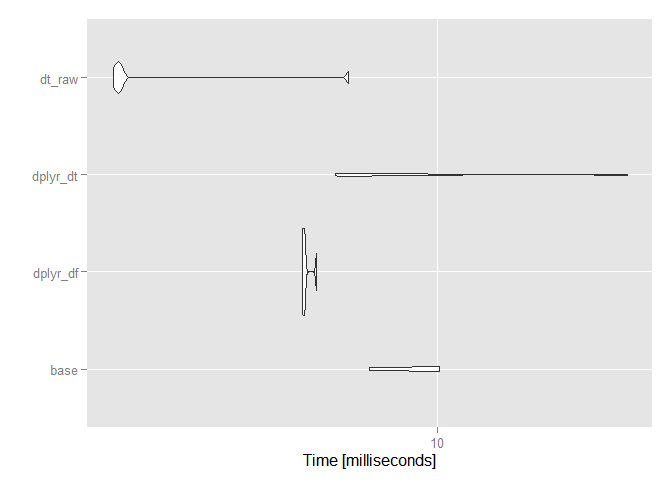
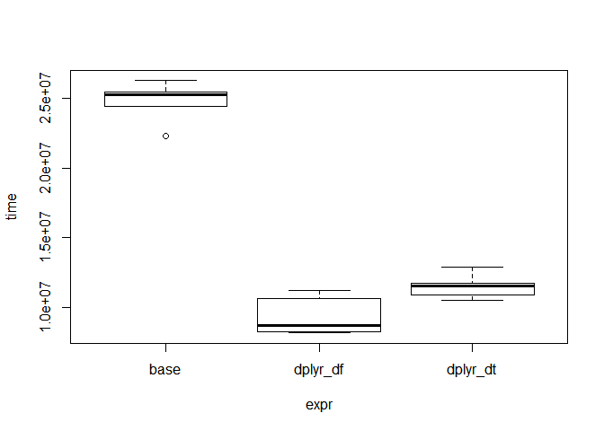
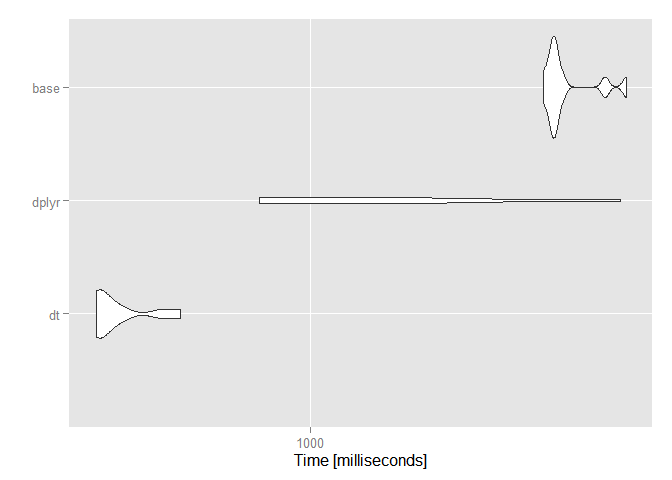

Benchmarking dplyr
==================

Aqui un breve intento de comparar las rapidez de `dplyr` con `data.tables`, `tbl+data.tables`, etc.

> ES SOLO UN BORRADOR!!

Cargamos los datos:

``` r
devtools::install_github("splatsh/tarjetasblack")
library(tarjetasblack)
```

...y las librerias:

``` r
library(dplyr)
```

    ## Warning: package 'dplyr' was built under R version 3.1.3

    ## 
    ## Attaching package: 'dplyr'
    ## 
    ## The following object is masked from 'package:stats':
    ## 
    ##     filter
    ## 
    ## The following objects are masked from 'package:base':
    ## 
    ##     intersect, setdiff, setequal, union

``` r
library(ggplot2)
library(microbenchmark)
```

#### Aggregación

``` r
options(digits = 3, microbenchmark.unit = "ms")

# reset
rm(movimientos)
```

    ## Warning in rm(movimientos): object 'movimientos' not found

``` r
library(tarjetasblack)
movimientos_df <- tbl_df(movimientos)
movimientos_dt <- tbl_dt(movimientos)
```

    ## Loading required namespace: data.table

``` r
bch1 <- microbenchmark(
  base =     tapply(movimientos_df$importe, movimientos_df$nombre, FUN = mean),
  dplyr_df = movimientos_df %>% group_by(nombre) %>% summarise(a = mean(importe)),
  dplyr_dt = movimientos_dt %>% group_by(nombre) %>% summarise(a = mean(importe)),
  dt_raw =   movimientos_dt[, list(a = mean(importe)), by = nombre],
  times = 5
)
autoplot(bch1)
```



#### Filtrage

``` r
res1 <- microbenchmark(
  base =    movimientos_df[ave(movimientos_df$importe, movimientos_df$nombre, FUN = max) == movimientos_df$importe,],
  dplyr_df = movimientos_df %>% group_by(nombre) %>% filter(importe == max(importe)),
  dplyr_dt = movimientos_dt %>% group_by(nombre) %>% filter(importe == max(importe)),
  times = 5
)
plot(res1)
```



Nota: el orden tiene importancía:

`r   res <- microbenchmark(   a = movimientos %>% select(actividad_completa) %>% arrange(actividad_completa) %>% distinct(),   b = movimientos %>% select(actividad_completa) %>% distinct() %>% arrange(actividad_completa)   , times = 10)   res   autoplot(res)`

``` r
n <- 1e+7
factores <- c("A", "B", "C", "D", "E", "F")

big <- data.frame(factores = as.factor(sample(factores, n, replace = TRUE))
                  , percent = round(runif(n, min = 0, max = 1), digits = 2)
)

str(big)
print(object.size(big), units = "GB")

big.dt <- tbl_dt(big)

plot(microbenchmark(
  #plyr = ddply(big, .(factores), summarise, total = sum(percent)) ,
  dplyr = big %>% group_by(factores) %>% summarise(total = sum(percent)),
  data.table = big.dt[, list(total = sum(percent)), by = factores],
  dplyr.dt = big.dt %>% group_by(factores) %>% summarise(total = sum(percent)),
  times = 10))
```

``` r
require(data.table)
```

    ## Loading required package: data.table
    ## 
    ## Attaching package: 'data.table'
    ## 
    ## The following objects are masked from 'package:dplyr':
    ## 
    ##     between, last

``` r
N=2e7; K=100
set.seed(1)
DT <- data.table(
  id1 = sample(sprintf("id%03d",1:K), N, TRUE),      # large groups (char)
  id2 = sample(sprintf("id%03d",1:K), N, TRUE),      # large groups (char)
  id3 = sample(sprintf("id%010d",1:(N/K)), N, TRUE), # small groups (char)
  id4 = sample(K, N, TRUE),                          # large groups (int)
  id5 = sample(K, N, TRUE),                          # large groups (int)
  id6 = sample(N/K, N, TRUE),                        # small groups (int)
  v1 =  sample(5, N, TRUE),                          # int in range [1,5]
  v2 =  sample(5, N, TRUE),                          # int in range [1,5]
  v3 =  sample(round(runif(100,max=100),4), N, TRUE) # numeric e.g. 23.5749
)


DF <- as.data.frame(DT)
tbl_dt <- tbl_dt(DT)
library(microbenchmark)
library(dplyr)
library(ggplot2)

res <- microbenchmark(
  dt = DT[, sum(v1), keyby=id1],
  dplyr = tbl_dt %>% group_by(id1) %>% summarise(sum(v1)),
  base = tapply(DF$v1, DF$id1, FUN = sum)
  , times = 10, unit = "ms")
res
```

    ## Unit: milliseconds
    ##   expr  min   lq mean median   uq  max neval
    ##     dt  393  397  435    404  444  569    10
    ##  dplyr  793  873 1532   1268 1768 3901    10
    ##   base 2761 2863 3065   2897 3002 3965    10

``` r
autoplot(res) + expand_limits(x = 0)
```


